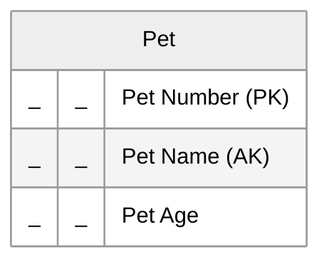

# Figure 14

An alternate key on Pet Name means we cannot have two pets with the same name. In a Mermaid entity-relationship diagram (erDiagram), entity attributes are expressed as type-name-comment lines, where type is the data type and name is the physical-model name (i.e. without spaces). To emphasize that we are working at the logical refinement level and not at the physical design level, we "stub out" the type and name fields with underscores.

