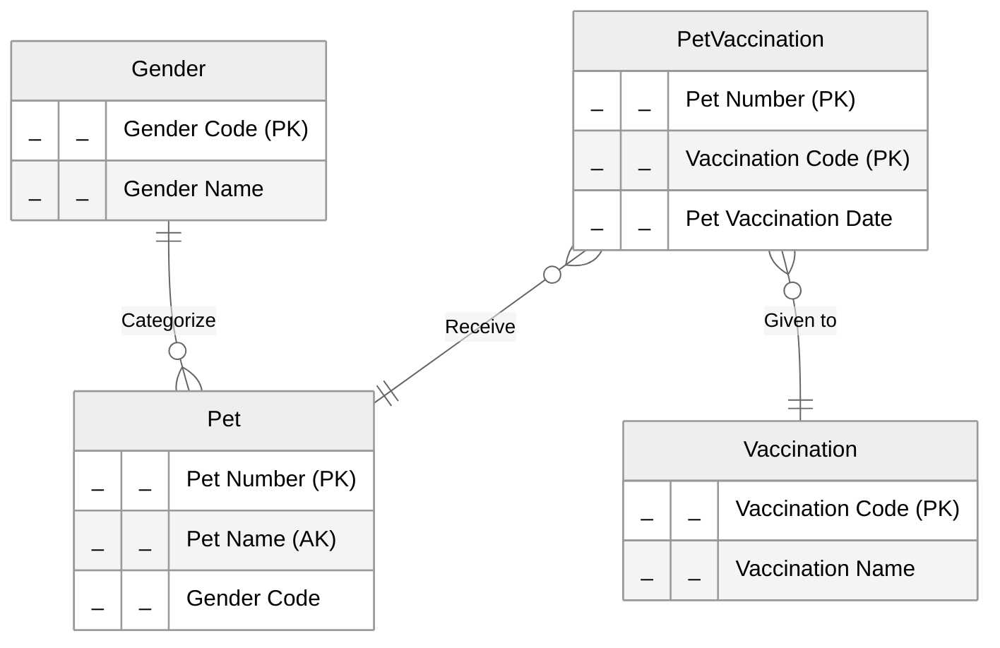

# Figure 15

The entity on each "many" side contains a foreign key pointing back to the primary key from the entity on the "one" side.

```mermaid
%%{init: {"theme": "neutral"} }%%
erDiagram
    Pet {
        _ _ "Pet Number (PK)"
        _ _ "Pet Name (AK)"
        _ _ "Gender Code"
    }
    Gender {
        _ _ "Gender Code (PK)"
        _ _ "Gender Name"
    }
    PetVaccination {
        _ _ "Pet Number (PK)"
        _ _ "Vaccination Code (PK)"
        _ _ "Pet Vaccination Date"
    }
    Vaccination {
        _ _ "Vaccination Code (PK)"
        _ _ "Vaccination Name"
    }
    Gender ||--o{ Pet : Categorize
    PetVaccination }o--|| Pet : Receive
    PetVaccination }o--|| Vaccination : "Given to"
```