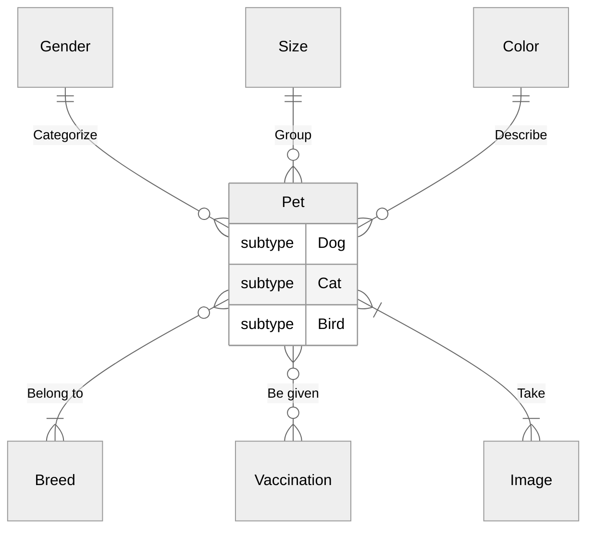

# Figure 16

A business terms model for our animal shelter.
Mermaid entity-relationship (ER) diagrams, unlike flowchart diagrams, do not support subgraphs.
Here, we use ER diagram attributes to designate our Pet subtypes.

