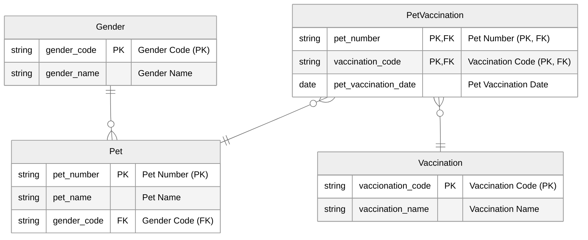

# Figure 18

Relational physical data models for our animal shelter.

```mermaid
%%{init: {"theme": "neutral"} }%%
erDiagram
    Pet {
        string pet_number PK "Pet Number (PK)"
        string pet_name "Pet Name"
        string gender_code FK "Gender Code (FK)"
    }
    Gender {
        string gender_code PK "Gender Code (PK)"
        string gender_name "Gender Name"
    }
    PetVaccination {
        string pet_number PK,FK "Pet Number (PK, FK)"
        string vaccination_code PK,FK "Vaccination Code (PK, FK)"
        date pet_vaccination_date "Pet Vaccination Date"
    }
    Vaccination {
        string vaccionation_code PK "Vaccination Code (PK)"
        string vaccination_name "Vaccination Name"
    }
    Gender ||--o{ Pet : ""
    PetVaccination }o--|| Pet: ""
    PetVaccination }o--|| Vaccination: ""
```