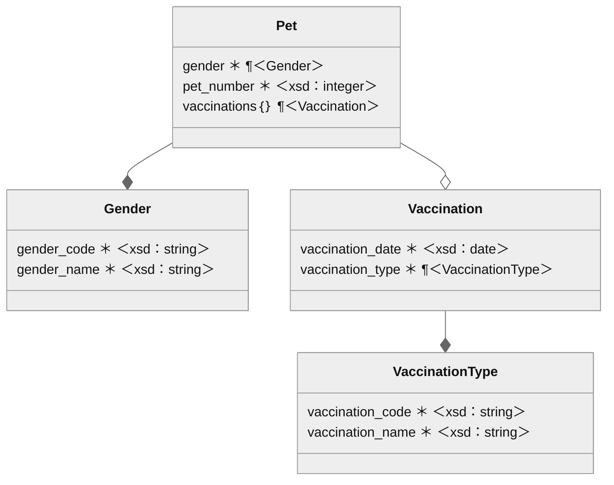

# Figure 19

Nested physical data models for our animal shelter.
This diagram uses Mermaid’s class-diagram mode.
“¶” indicates a reference rather than an embedding.
“{}” indicates a Set collection.
A filled-in diamond signifies composition, and an open diamond signifies aggregation.
“*” indicates the attribute is required.

