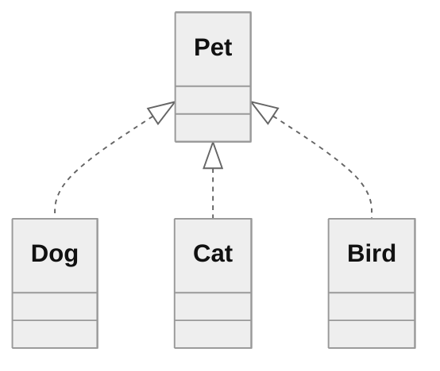

# Figure 20

Relational BTM.
Mermaid entity-relationship diagrams, unlike flowchart diagrams, do not support subgraphs.
Here, we copy-paste a Mermaid class diagram with inheritance arrows to designate our Pet subtypes.

See Figure 16.