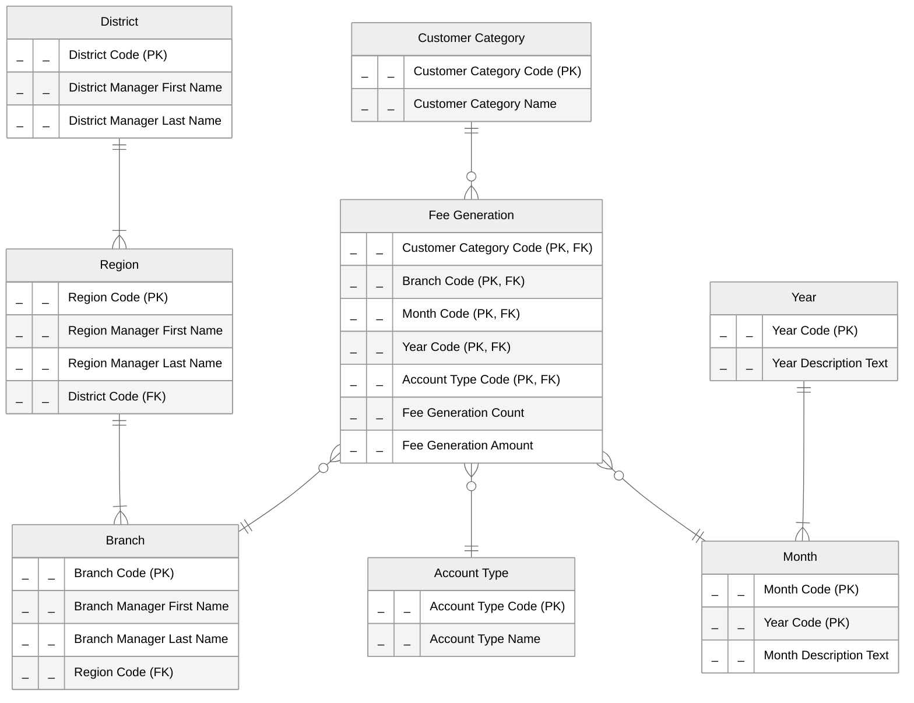

# Figure 25

A dimensional LDM for a bank.

```mermaid
%%{init: {"theme": "neutral"} }%%
erDiagram
    District ||--|{ Region : ""
    Region ||--|{ Branch : ""
    "Fee Generation" }o--|| Branch : ""
    "Customer Category" ||--o{ "Fee Generation": ""
    "Fee Generation" }o--|| "Account Type" : ""
    "Fee Generation" }o--|| Month : ""
    Year ||--|{ Month : ""
    District {
        _ _ "District Code (PK)"
        _ _ "District Manager First Name"
        _ _ "District Manager Last Name"
    }
    Region {
        _ _ "Region Code (PK)"
        _ _ "Region Manager First Name"
        _ _ "Region Manager Last Name"
        _ _ "District Code (FK)"
    }
    Branch {
        _ _ "Branch Code (PK)"
        _ _ "Branch Manager First Name"
        _ _ "Branch Manager Last Name"
        _ _ "Region Code (FK)"
    }
    "Customer Category" {
        _ _ "Customer Category Code (PK)"
        _ _ "Customer Category Name"
    }
    "Fee Generation" {
        _ _ "Customer Category Code (PK, FK)"
        _ _ "Branch Code (PK, FK)"
        _ _ "Month Code (PK, FK)"
        _ _ "Year Code (PK, FK)"
        _ _ "Account Type Code (PK, FK)"
        _ _ "Fee Generation Count"
        _ _ "Fee Generation Amount"
    }
    "Account Type" {
        _ _ "Account Type Code (PK)"
        _ _ "Account Type Name"
    }
    Year {
        _ _ "Year Code (PK)"
        _ _ "Year Description Text"
    }
    Month {
        _ _ "Month Code (PK)"
        _ _ "Year Code (PK)"
        _ _ "Month Description Text"
    }
```