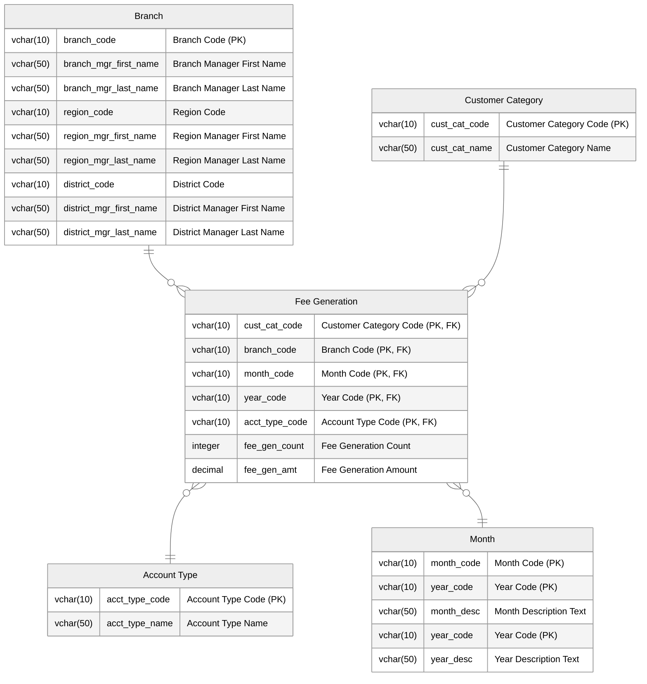

# Figure 26

A dimensional PDM for a bank. "vchar" is a character-string field with variable but fixed-maximum length.

```mermaid
%%{init: {"theme": "neutral"} }%%
erDiagram
     Branch ||--o{ "Fee Generation" : ""
    "Customer Category" ||--o{ "Fee Generation": ""
    "Fee Generation" }o--|| "Account Type" : ""
    "Fee Generation" }o--|| Month : ""
    Branch {
        vchar(10) branch_code "Branch Code (PK)"
        vchar(50) branch_mgr_first_name "Branch Manager First Name"
        vchar(50) branch_mgr_last_name "Branch Manager Last Name"
        vchar(10) region_code "Region Code"
        vchar(50) region_mgr_first_name "Region Manager First Name"
        vchar(50) region_mgr_last_name "Region Manager Last Name"        
        vchar(10) district_code "District Code"
        vchar(50) district_mgr_first_name "District Manager First Name"
        vchar(50) district_mgr_last_name "District Manager Last Name"           
    }
    "Customer Category" {
        vchar(10) cust_cat_code "Customer Category Code (PK)"
        vchar(50) cust_cat_name "Customer Category Name"
    }
    "Fee Generation" {
        vchar(10) cust_cat_code "Customer Category Code (PK, FK)"
        vchar(10) branch_code "Branch Code (PK, FK)"
        vchar(10) month_code "Month Code (PK, FK)"
        vchar(10) year_code "Year Code (PK, FK)"
        vchar(10) acct_type_code "Account Type Code (PK, FK)"
        integer fee_gen_count "Fee Generation Count"
        decimal fee_gen_amt "Fee Generation Amount"
    }
    "Account Type" {
        vchar(10) acct_type_code "Account Type Code (PK)"
        vchar(50) acct_type_name "Account Type Name"
    }
    Month {
        vchar(10) month_code "Month Code (PK)"
        vchar(10) year_code "Year Code (PK)"
        vchar(50) month_desc "Month Description Text"
        vchar(10) year_code "Year Code (PK)"
        vchar(50) year_desc "Year Description Text"        
    }
```