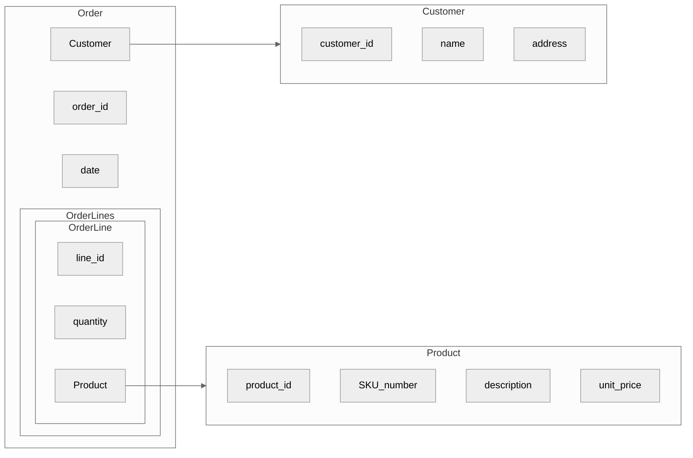

# Figure 29

A query LDM.
The Customer and Product entities are logically independent of an Order entity with regard to data lifecycle,
rather than strictly embedded within an Order.

```mermaid
%%{init: {"theme": "neutral"} }%%
flowchart LR

subgraph Order
order_id
date
OrderCustomer["Customer"]
subgraph OrderLines
subgraph OrderLine
line_id
quantity
OrderLineProduct["Product"]
end
end
end

subgraph Customer
customer_id
name
address
end

subgraph Product
product_id
SKU_number
description
unit_price
end

OrderCustomer --> Customer
OrderLineProduct --> Product
```