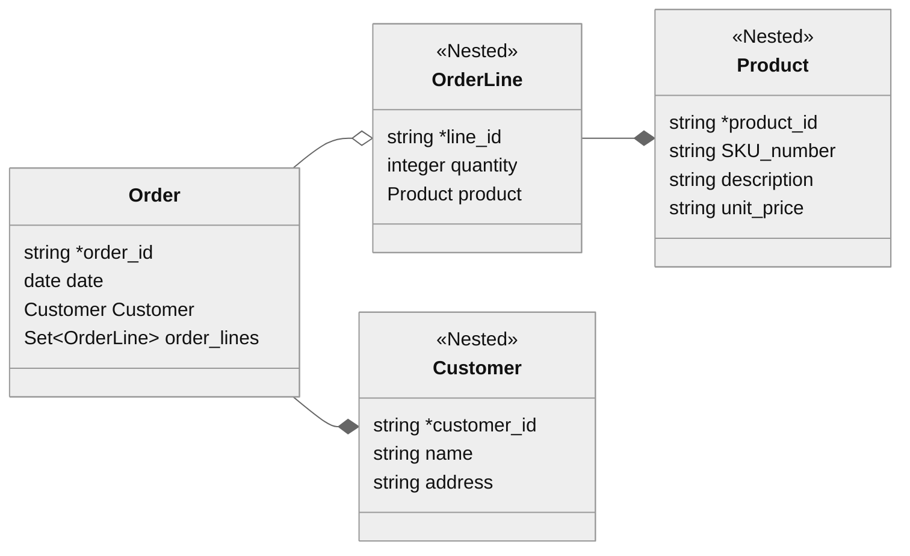

# Figure 30

A query PDM.

```mermaid
%%{init: {"theme": "neutral"} }%%
classDiagram
direction LR
class Order {
string *order_id
date date
Customer Customer
Set~OrderLine~ order_lines
}

class OrderLine {
    <<Nested>>
    string *line_id
    integer quantity
    Product product
}

class Customer {
    <<Nested>>
string *customer_id
string name
string address
}

class Product {
    <<Nested>>
string *product_id
string SKU_number
string description
string unit_price
}

Order --o OrderLine
Order --* Customer
OrderLine --* Product
```