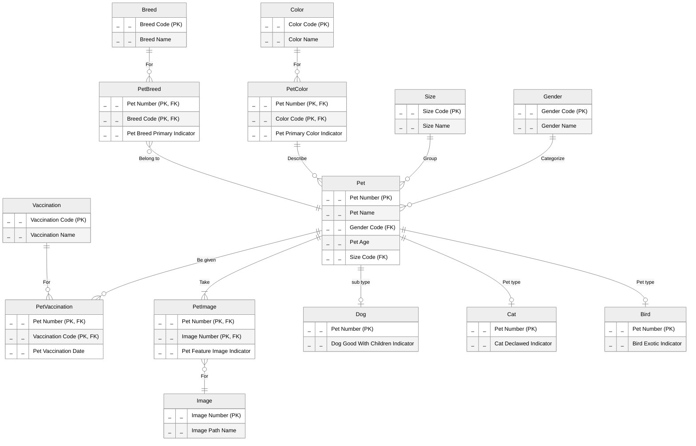

# Figure 41

Animal shelter relational LDM.

```mermaid
%%{init: {"theme": "neutral"} }%%
erDiagram
    Gender {
        _ _ "Gender Code (PK)"
        _ _ "Gender Name"
    }    
    Size {
        _ _ "Size Code (PK)"
        _ _ "Size Name"
    }
    PetColor {
        _ _ "Pet Number (PK, FK)"
        _ _ "Color Code (PK, FK)"
        _ _ "Pet Primary Color Indicator"
    }
    Color {
        _ _ "Color Code (PK)"
        _ _ "Color Name"           
    }
    Breed {
        _ _ "Breed Code (PK)"
        _ _ "Breed Name"
    }
    PetBreed {
        _ _ "Pet Number (PK, FK)"
        _ _ "Breed Code (PK, FK)"
        _ _ "Pet Breed Primary Indicator"
    }
    Pet {
        _ _ "Pet Number (PK)"
        _ _ "Pet Name"
        _ _ "Gender Code (FK)"
        _ _ "Pet Age"
        _ _ "Size Code (FK)"
    }
    Vaccination {
        _ _ "Vaccination Code (PK)"
        _ _ "Vaccination Name"
    }
    PetVaccination {
        _ _ "Pet Number (PK, FK)"
        _ _ "Vaccination Code (PK, FK)"
        _ _ "Pet Vaccination Date"
    }
    PetImage {
        _ _ "Pet Number (PK, FK)"
        _ _ "Image Number (PK, FK)"
        _ _ "Pet Feature Image Indicator"
    }
    Image {
        _ _ "Image Number (PK)"
        _ _ "Image Path Name"
    }
    Dog {
        _ _ "Pet Number (PK)"
        _ _ "Dog Good With Children Indicator"
    }
    Cat {
        _ _ "Pet Number (PK)"
        _ _ "Cat Declawed Indicator"
    }
    Bird {
        _ _ "Pet Number (PK)"
        _ _ "Bird Exotic Indicator"
    }

    Gender ||--o{ Pet : Categorize
    Size ||--o{ Pet : Group
    PetColor ||--o{ Pet : Describe
    Color ||--o{ PetColor: "For"

    Breed ||--o{ PetBreed : "For"
    PetBreed }o--|| Pet : "Belong to"

    Pet ||--o{ PetVaccination : "Be given"
    Vaccination ||--o{ PetVaccination: "For"
    
    Pet ||--|{ PetImage : Take
    PetImage }o--|| Image : "For"
    
    Pet ||--o| Dog : "sub type"
    Pet ||--o| Cat : "Pet type"
    Pet ||--o| Bird : "Pet type"
```