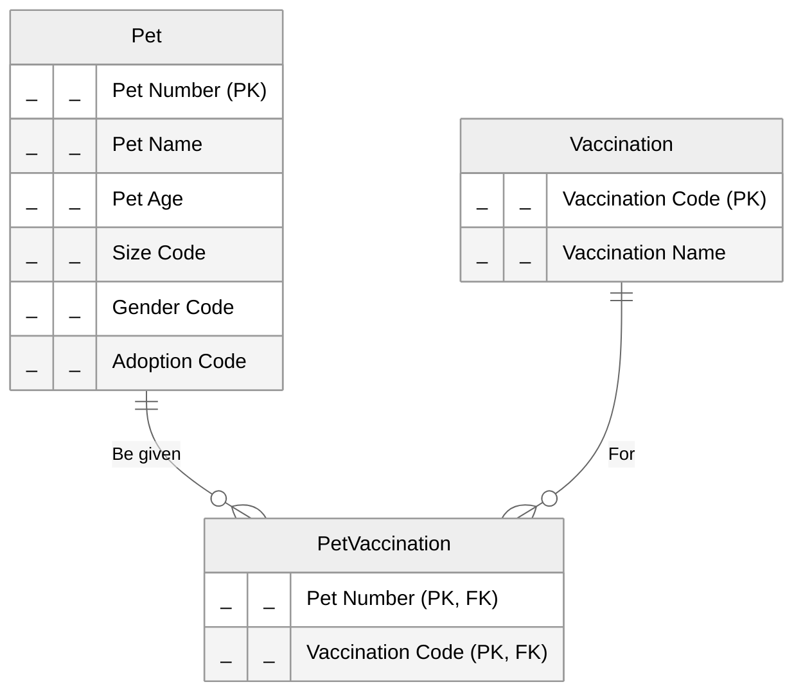

# Figure 43

Normalized model subset.

```mermaid
%%{init: {"theme": "neutral"} }%%
erDiagram
    Pet {
        _ _ "Pet Number (PK)"
        _ _ "Pet Name"
        _ _ "Pet Age"
        _ _ "Size Code"        
        _ _ "Gender Code"
        _ _ "Adoption Code"

    }
    Vaccination {
        _ _ "Vaccination Code (PK)"
        _ _ "Vaccination Name"
    }
    PetVaccination {
        _ _ "Pet Number (PK, FK)"
        _ _ "Vaccination Code (PK, FK)"
    }
    Pet ||--o{ PetVaccination : "Be given"
    Vaccination ||--o{ PetVaccination : "For"
```