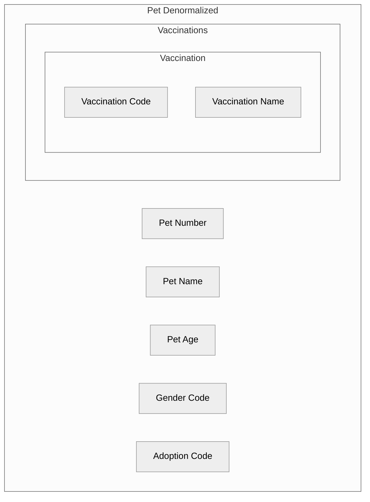

# Figure 44

Denormalized model subset.

```mermaid
%%{init: {"theme": "neutral"} }%%
flowchart TB

subgraph Pe["Pet Denormalized"]
pet_number["Pet Number"]
pet_name["Pet Name"]
pet_age_qty["Pet Age"]
gender_code["Gender Code"]
adoption_code["Adoption Code"]
subgraph Vaccinations
subgraph Vaccination
vcode["Vaccination Code"]
vname["Vaccination Name"]
end
end
end
```