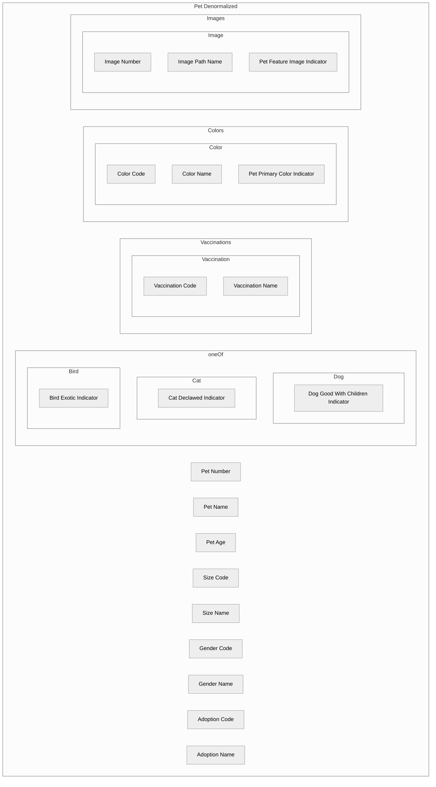

# Figure 46

A complete LDM with Pet Type.

```mermaid
%%{init: {"theme": "neutral"} }%%
flowchart TB

subgraph Pe["Pet Denormalized"]
pet_number["Pet Number"]
pet_name["Pet Name"]
pet_age_qty["Pet Age"]
size_code["Size Code"]
size_name["Size Name"]
gender_code["Gender Code"]
gender_name["Gender Name"]
adoption_code["Adoption Code"]
adoption_name["Adoption Name"]
subgraph oneOf
subgraph Dog
dgwci["Dog Good With Children Indicator"]
end
subgraph Cat
cdi["Cat Declawed Indicator"]
end
subgraph Bird
bei["Bird Exotic Indicator"]
end
end
subgraph Vaccinations
subgraph Vaccination
vcode["Vaccination Code"]
vname["Vaccination Name"]
end
end

subgraph Colors
subgraph Color
ccode["Color Code"]
cname["Color Name"]
ppco["Pet Primary Color Indicator"]
end
end

subgraph Images
subgraph Image
inum["Image Number"]
ipathname["Image Path Name"]
pfia["Pet Feature Image Indicator"]
end
end

end
```