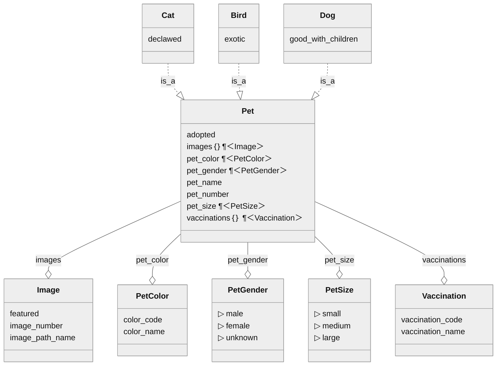

# Figure 47

A complete LDM with inheritance and enumeration types.

```mermaid
%%{init: {"theme": "neutral"} }%%
classDiagram
direction TB

  `Cat` ..|> `Pet` : is_a
  class `Cat` {
    declawed
  }
  `Bird` ..|> `Pet` : is_a
  class `Bird` {
    exotic
  }
  `Dog` ..|> `Pet` : is_a
  class `Dog` {
    good_with_children
  }
  `Pet` --o `Image` : images
  `Pet` --o `PetColor` : pet_color
  `Pet` --o `PetGender` : pet_gender
  `Pet` --o `PetSize` : pet_size
  `Pet` --o `Vaccination` : vaccinations
  class `Pet` {
    adopted
    images｛｝¶＜Image＞
    pet_color ¶＜PetColor＞
    pet_gender ¶＜PetGender＞
    pet_name
    pet_number
    pet_size  ¶＜PetSize＞
    vaccinations｛｝ ¶＜Vaccination＞
  }
  class `PetColor` {
    color_code 
    color_name 
  }
  class `Image` {
    featured 
    image_number 
    image_path_name
  }
  class `Vaccination` {
    vaccination_code
    vaccination_name
  }
  class `PetGender` {
    ▷ male
    ▷ female
    ▷ unknown
  }
  class `PetSize` {
    ▷ small
    ▷ medium
    ▷ large
  }
```