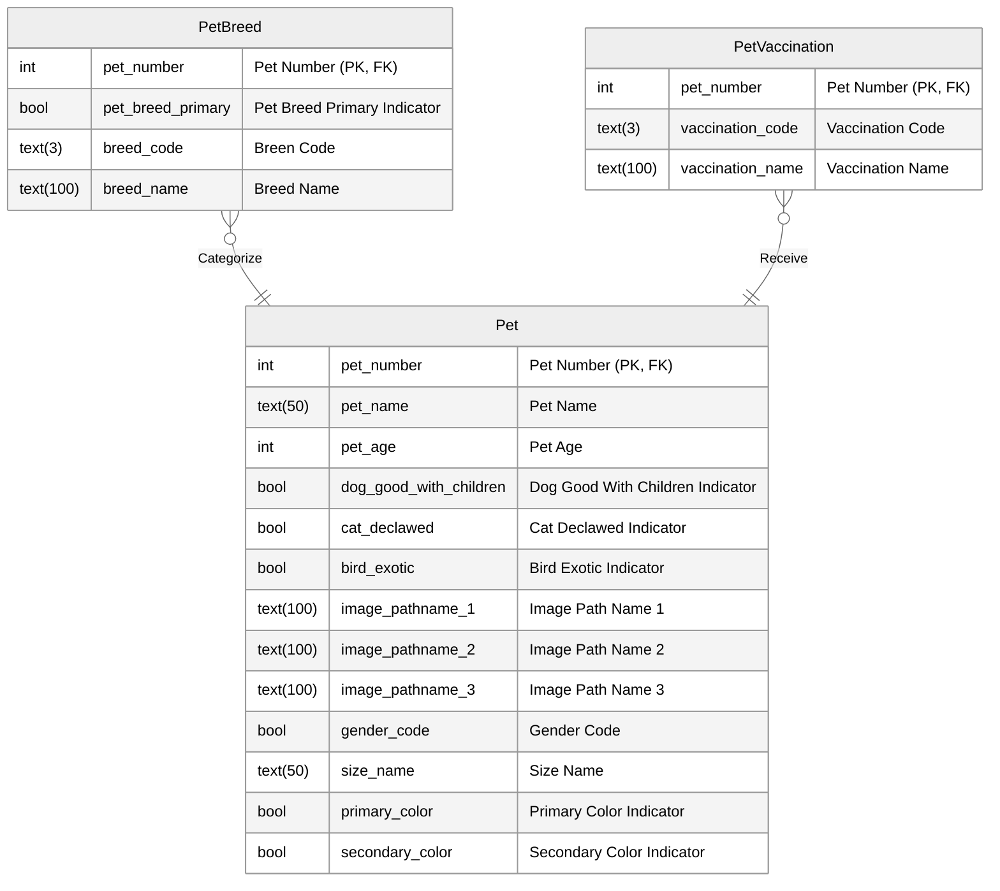

# Figure 48

PDM of the shelter's Access database

```mermaid
%%{init: {"theme": "neutral"} }%%
erDiagram
    PetBreed }o--|| Pet : "Categorize"
    PetVaccination }o--|| Pet : "Receive"
    PetBreed {
        int pet_number "Pet Number (PK, FK)"
        bool pet_breed_primary "Pet Breed Primary Indicator"
        text(3) breed_code "Breen Code"
        text(100) breed_name "Breed Name"       
    }
    PetVaccination {
        int pet_number "Pet Number (PK, FK)"
        text(3) vaccination_code "Vaccination Code"
        text(100) vaccination_name "Vaccination Name"
    }
    Pet {
        int pet_number "Pet Number (PK, FK)"
        text(50) pet_name "Pet Name"
        int pet_age "Pet Age"
        bool dog_good_with_children "Dog Good With Children Indicator"
        bool cat_declawed "Cat Declawed Indicator"
        bool bird_exotic "Bird Exotic Indicator"
        text(100) image_pathname_1 "Image Path Name 1"
        text(100) image_pathname_2 "Image Path Name 2"
        text(100) image_pathname_3 "Image Path Name 3"
        bool gender_code "Gender Code"
        text(50) size_name "Size Name"
        bool primary_color "Primary Color Indicator"
        bool secondary_color "Secondary Color Indicator"
    }
```